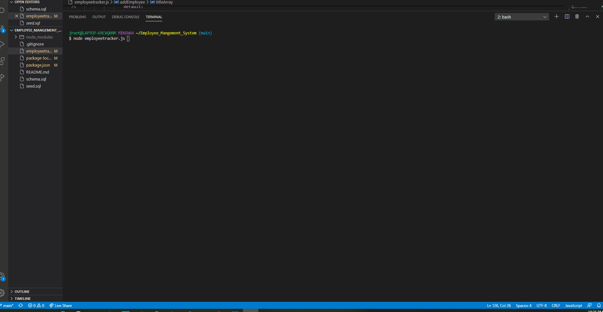

# Employee_Mangement_System

## Description 

This is a CWRU coding bootcamp homework assignment practicing MySQL, Node.js and express working with a database.  The project tests the students ability to work from a database and create queries that can join tables together.  The project allows for additions to be inserted into the table as well as removed or changed.  The poject used POST, PUT, and DELETE with MySQL. 

AS A USER I would like to be able to view and manage the departments, roles and employees in a company so i can optimize and organize my business plan.

## Table of Contents

* [Installation](#installation)

* [Usage](#usage)

* [Contributions](#contributions)

* [Tests](#tests)

* [License](#license)

* [Questions](#questions)

* [Future](#future)

* [Contact](#contact)

## Installation
node.js, NPM express, MySQL, console.table, inquirer

## Usage
The project is used to keep an orgainzed list of employees with their roles, salaries and managers.

My Tests

## Contributions
Jordan Rantucci

## Tests
This project uses express to save and store the information.

## License 
 

# Questions
See Contact Section

# Future
Update the styling to personalize the notebook

# Contact

GitHub username: jordanrantucci and Email address: jordanrantucci@gmail.com
